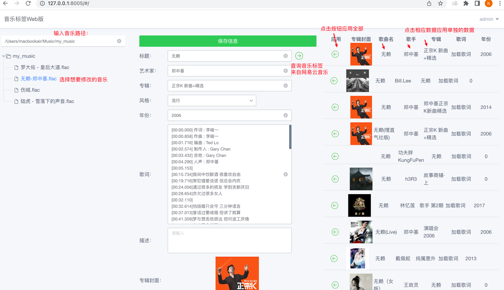

# Music Tag Web
『音乐标签』Web版是一款可以编辑歌曲的标题，专辑，艺术家，歌词，封面等信息的应用程序， 支持FLAC, APE, WAV, AIFF, WV, TTA, MP3, MP4, M4A, OGG, MPC, OPUS, WMA, DSF, DFF等音频格式，绿色无广告，无任何功能限制。
# Why me
为什么开发web版？
在使用Navidrome时，我的音乐都是在远程服务器上的，本地的Musictag和mp3tag不能满足我的需求，
我需要部署在远程服务器上去需改线上的音乐标签，相当于在使用Navidrome的边车应用。
# How to Build
1. docker-compose -f local.yml build
2. docker-compose -f local.yml up

