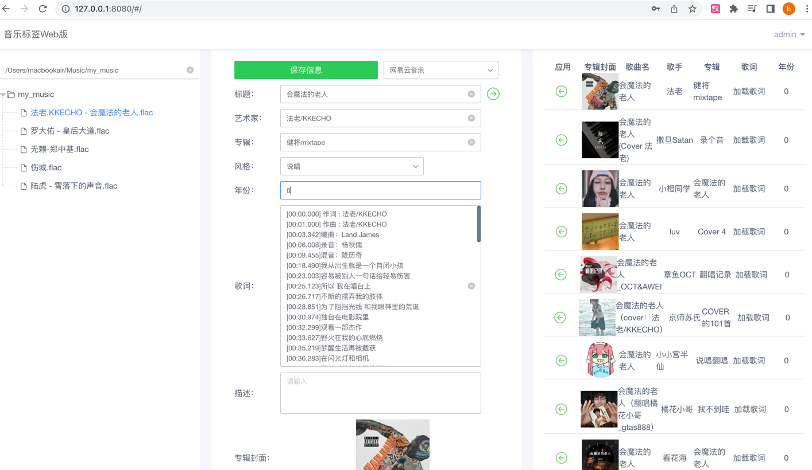
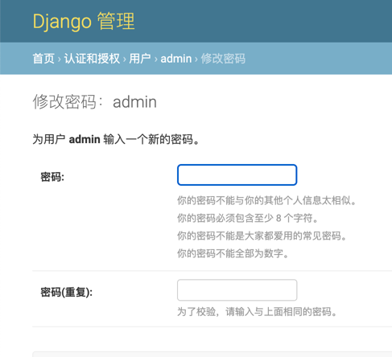
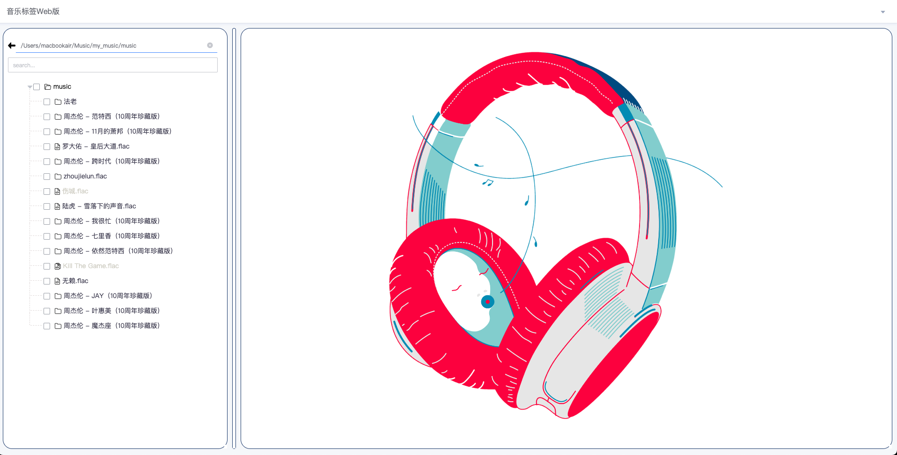
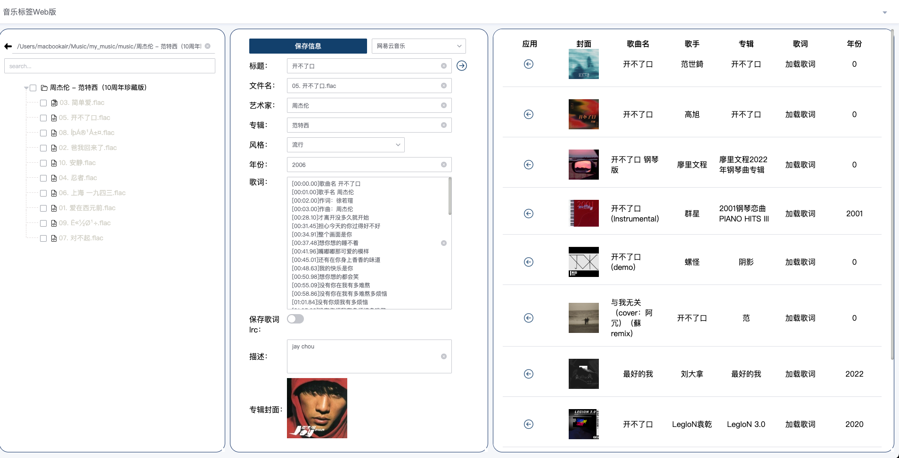
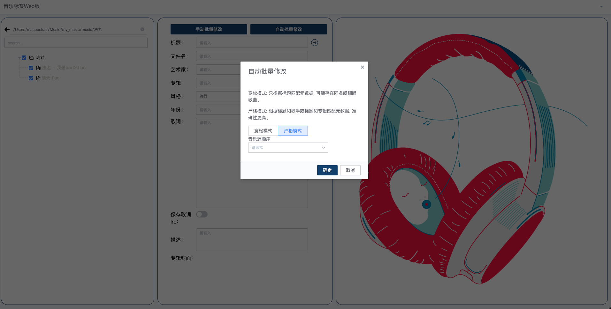
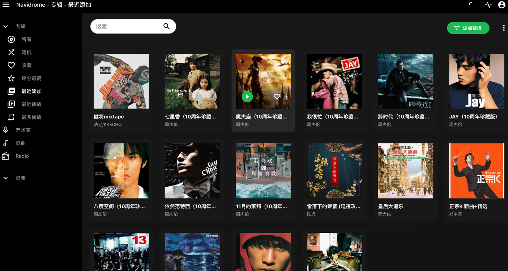

# 🚀 Music Tag Web

『音乐标签』Web版是一款可以编辑歌曲的标题，专辑，艺术家，歌词，封面等信息的音乐标签编辑器程序， 支持FLAC, APE, WAV, AIFF, WV, TTA, MP3, M4A, OGG, MPC, OPUS, WMA, DSF,
DFF, MP4等音频格式。
<div class="column" align="middle">
   
  
  
</div>

# 🎉 Feature

为什么开发web版？ 在使用Navidrome时，我的音乐都是在远程服务器上的，本地的Musictag和mp3tag不能满足我的需求， 我需要部署在远程服务器上去需改线上的音乐标签，相当于在使用Navidrome的边车应用。
- 支持大部分音频格式元数据的查看、编辑和修改
- 支持批量自动修改（刮削）音乐标签
- 支持音乐指纹识别，即使没有元数据也可以识别音乐
- 支持整理音乐文件，按艺术家，专辑分组， 或者自定义多级分组
- 支持文件排序，按照文件名，文件大小，更新时间排序
- 支持批量转换音乐元数据繁体转简体，或者简体转繁体
- 支持文件名称的拆分解包，补充缺失元数据信息
- 支持文本替换，批量替换音乐元数据中脏数据
- 支持音乐格式转换，引入 ffmpeg 支持音乐格式转换
- 支持整轨音乐文件的切割
- 支持多种音乐标签来源
- 支持歌词翻译功能
- 支持显示操作记录
- 支持导出专辑封面文件，支持自定义上传专辑封面
- 支持适配移动端 UI，支持手机端访问


# 🦀 Show Project
DEMO 地址账号密码为：admin/admin

[【音乐标签Web｜Music Tag Web】](http://42.193.218.103:8002/#/)

# 🔨 How to Build

1. docker-compose -f local.yml build
2. docker-compose -f local.yml up

# 💯 How to Use
[【使用手册】](https://xiers-organization.gitbook.io/music-tag-web/)

镜像已上传至Dockerhub 操作指南：

### 从Docker Hub拉取镜像

1`docker pull xhongc/music_tag_web:latest`

### dokcer run

2. `docker run -d -p 8001:8001 -v /path/to/your/music:/app/media -v /path/to/your/config:/app/data --restart=always xhongc/music_tag_web:latest`
   
或者 使用portainer stacks部署
   

```yaml
version: '3'

services:
  music-tag:
    image: xhongc/music_tag_web:latest
    container_name: music-tag-web
    ports:
      - "8001:8001"
    volumes:
      - /path/to/your/music:/app/media:rw
      - /path/to/your/config:/app/data
    command: /start
    restart: always
```
ps. `/path/to/your/music` 改成你的音乐文件夹路径！`/path/to/your/config` 改为配置文件路径！

3 访问在127.0.0.1:8001/admin 默认账号密码 admin/admin 修改默认密码


# 📷 User Interface





# 💬 Contact me
如有什么意见需求，请先 star 后提出issues，我会满足你的需求，在我的能力范围内。
issue 没及时看到的，可以加群讨论！(已经满200人，现在进群需手动拉，请添加我微信（备注：**Music Tag**），我会拉你进群。)
<div>
  &nbsp;
</div>
## 发布频道：

[t.me/music_tag_web](https://t.me/music_tag_web)

[MusicTag 交流群](https://t.me/+oTffyBoNALM3Yzll)


# 💸 赞助与支持
如果您觉得 music-tag-web 对你有帮助，可以请作者喝杯咖啡。
您的支持是我们更新软件的动力, 谢谢您! (｡･∀･)ﾉﾞ

[➡ 爱发电](https://afdian.net/a/music-tag-web)
<div>
  &nbsp; 
  &nbsp;
</div>

# 🌟 Star History

[](https://star-history.com/#xhongc/music-tag-web&Date)

# 免责声明
禁止任何形式的商业用途，包括但不仅限于售卖/打赏/获利，不得使用本代码进行任何形式的牟利/贩卖/传播，再次强调仅供个人私下研究学习技术使用，不提供下载音乐本体！ 本项目仅以纯粹的技术目的去学习研究，如有侵犯到任何人的合法权利，请致信408737515@qq.com，我将在第一时间修改删除相关代码，谢谢！

本项目基于 GPL V3.0 许可证发行，以下协议是对于 GPL V3.0 的补充，如有冲突，以以下协议为准。

词语约定：本协议中的“本项目”指music-tag-web项目；“使用者”指签署本协议的使用者；“官方音乐平台”指对本项目内置的包括酷我、网易云、QQ音乐、咪咕、酷狗音乐、酷我音乐等音乐源的官方平台统称；“版权数据”指包括但不限于图像、音频、名字、歌词等在内的他人拥有所属版权的数据。

本项目的数据来源原理是从各官方音乐平台的公开服务器中拉取数据，经过对数据简单地筛选与合并后进行展示，因此本项目不对数据的准确性负责。 使用本项目的过程中可能会产生版权数据，对于这些版权数据，本项目不拥有它们的所有权，为了避免造成侵权，使用者务必在24小时内清除使用本项目的过程中所产生的版权数据。 本项目内的官方音乐平台别名为本项目内对官方音乐平台的一个称呼，不包含恶意，如果官方音乐平台觉得不妥，可联系本项目更改或移除。 本项目内使用的部分包括但不限于字体、图片等资源来源于互联网，如果出现侵权可联系本项目移除。 由于使用本项目产生的包括由于本协议或由于使用或无法使用本项目而引起的任何性质的任何直接、间接、特殊、偶然或结果性损害（包括但不限于因商誉损失、停工、计算机故障或故障引起的损害赔偿，或任何及所有其他商业损害或损失）由使用者负责。 本项目完全免费，仅供个人私下小范围研究交流学习 python 技术使用, 且开源发布于 GitHub 面向全世界人用作对技术的学习交流，本项目不对项目内的技术可能存在违反当地法律法规的行为作保证，禁止在违反当地法律法规的情况下使用本项目，对于使用者在明知或不知当地法律法规不允许的情况下使用本项目所造成的任何违法违规行为由使用者承担，本项目不承担由此造成的任何直接、间接、特殊、偶然或结果性责任。 若你使用了本项目，将代表你接受以上协议。
