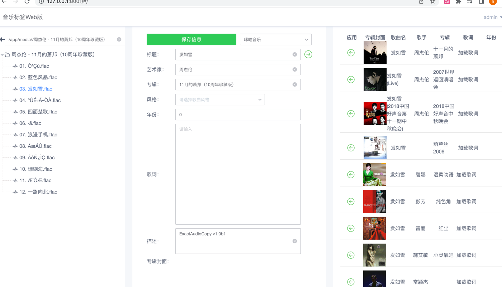

# 🚀 Music Tag Web

『音乐标签』Web版是一款可以编辑歌曲的标题，专辑，艺术家，歌词，封面等信息的应用程序， 支持FLAC, APE, WAV, AIFF, WV, TTA, MP3, MP4, M4A, OGG, MPC, OPUS, WMA, DSF,
DFF等音频格式，绿色无广告，无任何功能限制。

# 🎉 Feature

为什么开发web版？ 在使用Navidrome时，我的音乐都是在远程服务器上的，本地的Musictag和mp3tag不能满足我的需求， 我需要部署在远程服务器上去需改线上的音乐标签，相当于在使用Navidrome的边车应用。

- 该版本是我自用的小工具，如果你也有这个需求，可以使用。欢迎提出issues，我会满足你的需求，在我的能力范围内。

# 🦀 Show Project

[【音乐标签Web｜Music Tag Web】](http://42.193.218.103:8002/#/)

# 🔨 How to Build

1. docker-compose -f local.yml build
2. docker-compose -f local.yml up

# 💯 How to Use

镜像已上传至阿里云Docker Registry 操作指南：

### 从阿里云Docker Registry拉取镜像

1`docker pull registry.cn-hangzhou.aliyuncs.com/charles0519/music_tag_web:latest`

### dokcer run

2. `docker run -d -p 8001:8001 -v /path/to/your/music:/app/media --restart=always registry.cn-hangzhou.aliyuncs.com/charles0519/music_tag_web:latest`
   
或者 使用portainer stacks部署
   

```yaml
version: '3'

services:
  music-tag:
    image: registry.cn-hangzhou.aliyuncs.com/charles0519/music_tag_web:latest
    container_name: music-tag-web
    ports:
      - "8001:8001"
    volumes:
      - /path/to/your/music:/app/media:z
    command: /start
    restart: always
```

3 访问在127.0.0.1:8001

# 📷 User Interface





# 💬 Contact me
各位大佬有什么意见需求，欢迎提出issues，我会满足你的需求，在我的能力范围内。